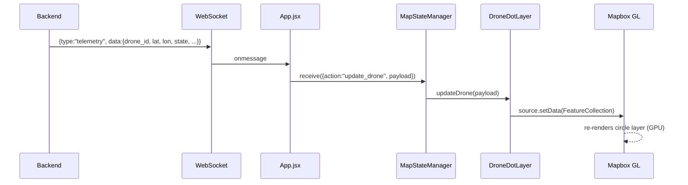
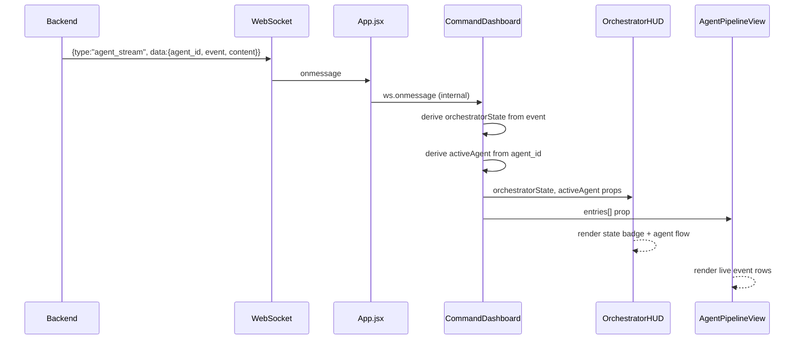

# Design Document: Drone UI + Agent Pipeline Visibility

## Overview

This feature replaces the existing CSS/rAF-animated drone HTML markers in `DroneManager.js` and `DispatchAnimation.js` with performant Mapbox GL JS native circle layers, and upgrades the agent pipeline panel in `CommandDashboard.jsx` to surface orchestrator state, active agent identity, and a visual agent flow diagram — all driven purely by the existing WebSocket event stream.

The change is entirely frontend-only. No backend Python files are modified. The WebSocket contract (`telemetry`, `agent_stream`, `markers`, `advisory` message types) is consumed as-is.

---

## Architecture

```mermaid
graph TD
    WS[WebSocket /ws]
    APP[App.jsx — WS hub]
    MSM[MapStateManager.js]
    DML[DroneDotLayer.js — NEW]
    MAP[Map.jsx]
    CD[CommandDashboard.jsx]
    APV[AgentPipelineView.jsx — NEW]
    OHB[OrchestratorHUD.jsx — NEW]

    WS -->|all messages| APP
    APP -->|telemetry → update_drone| MSM
    APP -->|agent_stream| CD
    APP -->|agent_stream| APV
    MSM -->|updateDrone| DML
    DML -->|setData on drones-source| MAP
    CD -->|orchestratorState, activeAgent| OHB
    APV -->|events[]| CD
```

### Key Architectural Decisions

- `DroneManager.js` is **replaced** by `DroneDotLayer.js`. The new module manages a single Mapbox GeoJSON source (`drones-source`) and two layers (`drones-dot`, `drones-label`). No HTML markers, no `requestAnimationFrame` lerp loop, no SVG.
- `DispatchAnimation.js` retains its fixed-wing and arrow animation (those are not drone telemetry), but its rotary drone HTML markers are removed. When Agent 2 deploys drones, they appear via the telemetry path through `DroneDotLayer`.
- `CommandDashboard.jsx` gains two new sub-components: `OrchestratorHUD` (state badge + active agent indicator) and `AgentPipelineView` (visual A1→A2→A3 flow with live event feed).
- Orchestrator state and active agent are derived from `agent_stream` events — no new WebSocket message types needed.

---

## Sequence Diagrams

### Drone Telemetry → Map Dot



### Agent Stream → Pipeline Panel



---

## Components and Interfaces

### DroneDotLayer.js (replaces DroneManager.js)

**Purpose**: Manages a single Mapbox GeoJSON source that represents all drone positions as a `FeatureCollection`. Exposes `init`, `updateDrone`, and `destroy`.

**Interface**:
```typescript
interface DroneDotLayer {
  init(map: mapboxgl.Map): void
  updateDrone(data: DronePayload): void
  destroy(): void
}

interface DronePayload {
  drone_id: string
  lat: number
  lon: number
  state: 'IDLE' | 'FLYING' | 'LOITERING' | 'RTL' | 'THERMAL_SCAN'
  battery_pct?: number
  alt?: number
  speed?: number
  disaster_type?: string
}
```

**Responsibilities**:
- Maintain an in-memory `Map<drone_id, DroneFeature>` of current drone positions and states
- On each `updateDrone` call, upsert the feature and call `source.setData(featureCollection)`
- No animation loop — position updates are instant (Mapbox handles rendering)
- Register click handler on `drones-dot` layer for popup

### OrchestratorHUD.jsx (new sub-component of CommandDashboard)

**Purpose**: Displays the current orchestrator state and which agent is active as a compact header strip above the pipeline feed.

**Interface**:
```typescript
interface OrchestratorHUDProps {
  orchestratorState: OrchestratorState
  activeAgent: AgentId | null
}

type OrchestratorState =
  | 'STANDBY'
  | 'SURVEILLANCE_ACTIVE'
  | 'SWARM_ACTIVE'
  | 'ADVISORY_ACTIVE'
  | 'MULTI_INCIDENT'
  | 'EMERGENCY'

type AgentId = 'AGENT_1' | 'AGENT_2' | 'AGENT_3' | 'ORCHESTRATOR'
```

**Responsibilities**:
- Render orchestrator state badge with color coding
- Render agent pipeline flow: `A1 → A2 → A3` with the active agent highlighted
- Derive active agent highlight from `activeAgent` prop

### AgentPipelineView.jsx (new sub-component of CommandDashboard)

**Purpose**: Renders the scrollable live event feed, replacing the inline entry rendering in `CommandDashboard`. Accepts a typed entries array.

**Interface**:
```typescript
interface AgentPipelineViewProps {
  entries: PipelineEntry[]
  activeIncidentType: string | null
}

interface PipelineEntry {
  id: string
  agent: AgentId
  event: string
  content: string
  ts: string
}
```

**Responsibilities**:
- Render entries in reverse-chronological order (newest at top)
- Color-code each row by agent using `AGENT_COLORS` from `constants.js`
- Truncate long content strings to 120 chars with ellipsis

---

## Data Models

### Drone GeoJSON Feature

Each drone is stored as a GeoJSON `Point` feature with properties encoding its state:

```typescript
interface DroneFeature {
  type: 'Feature'
  geometry: {
    type: 'Point'
    coordinates: [lon: number, lat: number]
  }
  properties: {
    drone_id: string
    state: DroneState
    dot_color: string      // hex, derived from state
    battery_pct: number
    alt: number
    speed: number
  }
}
```

### Drone State → Dot Color Mapping

| State | Color | Hex | Semantic |
|---|---|---|---|
| `IDLE` | Muted grey | `#7A8FA8` | Grounded, no mission |
| `FLYING` | Bright green | `#00FF88` | En route to target |
| `LOITERING` | Amber | `#FFB800` | Holding pattern |
| `RTL` | Red | `#FF3B3B` | Returning to launch |
| `THERMAL_SCAN` | Cyan | `#00BFFF` | Active sensor sweep |

These match the existing `DRONE_STATES` constant in `constants.js` — no new values needed.

### Orchestrator State → Derived from agent_stream Events

| `agent_id` + `event` pattern | Derived `orchestratorState` |
|---|---|
| `orchestrator` + `SURVEILLANCE_ACTIVE` in content | `SURVEILLANCE_ACTIVE` |
| `orchestrator` + `SWARM_ACTIVE` in content | `SWARM_ACTIVE` |
| `agent-3` + `advisory_issued` | `ADVISORY_ACTIVE` |
| No events yet | `STANDBY` |
| `orchestrator` + `EMERGENCY` in content | `EMERGENCY` |

Active agent is simply the `agent_id` of the most recent `agent_stream` event.

---

## Mapbox Layer Specification

### Source: `drones-source`

```javascript
map.addSource('drones-source', {
  type: 'geojson',
  data: { type: 'FeatureCollection', features: [] },
})
```

### Layer: `drones-dot`

```javascript
map.addLayer({
  id: 'drones-dot',
  type: 'circle',
  source: 'drones-source',
  paint: {
    'circle-radius': [
      'match', ['get', 'state'],
      'THERMAL_SCAN', 9,
      'LOITERING',    8,
      7               // default
    ],
    'circle-color': ['get', 'dot_color'],
    'circle-opacity': 0.92,
    'circle-stroke-width': 1.5,
    'circle-stroke-color': '#FFFFFF',
    'circle-stroke-opacity': 0.4,
    'circle-blur': [
      'match', ['get', 'state'],
      'THERMAL_SCAN', 0.3,
      0
    ],
  },
})
```

### Layer: `drones-label`

```javascript
map.addLayer({
  id: 'drones-label',
  type: 'symbol',
  source: 'drones-source',
  minzoom: 13,
  layout: {
    'text-field': ['get', 'drone_id'],
    'text-size': 9,
    'text-offset': [0, 1.4],
    'text-anchor': 'top',
    'text-font': ['DIN Offc Pro Regular', 'Arial Unicode MS Regular'],
  },
  paint: {
    'text-color': '#E8EDF5',
    'text-halo-color': '#0A0E14',
    'text-halo-width': 1,
  },
})
```

### Click Popup on `drones-dot`

```javascript
map.on('click', 'drones-dot', (e) => {
  const props = e.features[0].properties
  new mapboxgl.Popup({ closeButton: true, maxWidth: '200px' })
    .setLngLat(e.lngLat)
    .setHTML(`
      <div style="font-family:'JetBrains Mono',monospace;font-size:11px;line-height:1.8">
        <div><span style="color:#7A8FA8">ID   </span> ${props.drone_id}</div>
        <div><span style="color:#7A8FA8">STATE</span> ${props.state}</div>
        <div><span style="color:#7A8FA8">BAT  </span> ${props.battery_pct?.toFixed(0)}%</div>
        <div><span style="color:#7A8FA8">ALT  </span> ${props.alt?.toFixed(0)}m</div>
        <div><span style="color:#7A8FA8">SPD  </span> ${props.speed?.toFixed(1)} m/s</div>
      </div>
    `)
    .addTo(map)
})
```

---

## Agent Pipeline Visual Layout

The `OrchestratorHUD` renders a compact two-row strip:

```
Row 1:  [ORCHESTRATOR STATE BADGE]
Row 2:  [A1] ──▶ [A2] ──▶ [A3]
```

- Each agent node is a small pill/badge
- The active agent node gets a colored border + glow matching `AGENT_COLORS`
- Inactive agents are dimmed (`opacity: 0.35`)
- The arrows between nodes are static `──▶` text in `#2A3545`
- When a handoff occurs (active agent changes), the previously active node fades out and the new one lights up via CSS transition

### Orchestrator State Color Coding

| State | Color |
|---|---|
| `STANDBY` | `#4A6A8A` (muted blue) |
| `SURVEILLANCE_ACTIVE` | `#7B68EE` (Agent 1 purple) |
| `SWARM_ACTIVE` | `#FFB800` (amber) |
| `ADVISORY_ACTIVE` | `#00FF88` (green) |
| `MULTI_INCIDENT` | `#FF8C42` (orange) |
| `EMERGENCY` | `#FF3B3B` (red) |

---

## Key Functions with Formal Specifications

### DroneDotLayer.updateDrone()

```pascal
PROCEDURE updateDrone(payload)
  INPUT: payload { drone_id, lat, lon, state, battery_pct, alt, speed }
  OUTPUT: void (side effect: Mapbox source updated)

  PRECONDITIONS:
    - map is initialized and 'drones-source' exists
    - payload.drone_id is non-empty string
    - payload.lat ∈ [-90, 90], payload.lon ∈ [-180, 180]
    - payload.state ∈ {IDLE, FLYING, LOITERING, RTL, THERMAL_SCAN}

  SEQUENCE
    dot_color ← DRONE_STATE_COLORS[payload.state] ?? '#7A8FA8'

    feature ← {
      type: 'Feature',
      geometry: { type: 'Point', coordinates: [payload.lon, payload.lat] },
      properties: {
        drone_id: payload.drone_id,
        state: payload.state,
        dot_color: dot_color,
        battery_pct: payload.battery_pct ?? 0,
        alt: payload.alt ?? 0,
        speed: payload.speed ?? 0,
      }
    }

    droneFeatures[payload.drone_id] ← feature

    source ← map.getSource('drones-source')
    source.setData({
      type: 'FeatureCollection',
      features: Object.values(droneFeatures)
    })
  END SEQUENCE

  POSTCONDITIONS:
    - droneFeatures[payload.drone_id] reflects latest payload
    - Mapbox source contains updated FeatureCollection
    - No HTML markers created or modified
```

### deriveOrchestratorState()

```pascal
FUNCTION deriveOrchestratorState(entries)
  INPUT: entries[] — array of PipelineEntry, newest first
  OUTPUT: OrchestratorState string

  SEQUENCE
    IF entries is empty THEN
      RETURN 'STANDBY'
    END IF

    FOR each entry IN entries DO
      IF entry.agent = 'ORCHESTRATOR' THEN
        IF entry.content CONTAINS 'EMERGENCY' THEN RETURN 'EMERGENCY' END IF
        IF entry.content CONTAINS 'SWARM_ACTIVE' THEN RETURN 'SWARM_ACTIVE' END IF
        IF entry.content CONTAINS 'SURVEILLANCE_ACTIVE' THEN RETURN 'SURVEILLANCE_ACTIVE' END IF
      END IF
      IF entry.agent = 'AGENT_3' AND entry.event = 'advisory_issued' THEN
        RETURN 'ADVISORY_ACTIVE'
      END IF
    END FOR

    RETURN 'STANDBY'
  END SEQUENCE

  POSTCONDITIONS:
    - Returns one of the six valid OrchestratorState values
    - Scans entries in order (newest first), returns on first match
    - Pure function — no side effects
```

### deriveActiveAgent()

```pascal
FUNCTION deriveActiveAgent(entries)
  INPUT: entries[] — array of PipelineEntry, newest first
  OUTPUT: AgentId | null

  SEQUENCE
    IF entries is empty THEN RETURN null END IF
    RETURN entries[0].agent
  END SEQUENCE

  POSTCONDITIONS:
    - Returns agent_id of most recent event, or null if no events
    - O(1) — reads only first element
```

---

## Error Handling

### WebSocket Disconnect

The existing reconnect logic in `CommandDashboard` handles this. `OrchestratorHUD` shows `STANDBY` state when no events have arrived. No change needed.

### Unknown Drone State

If `payload.state` is not in `DRONE_STATE_COLORS`, `updateDrone` falls back to `#7A8FA8` (IDLE color). The dot still renders; it just uses the default color.

### Map Not Ready

`DroneDotLayer.updateDrone` is a no-op if `map` is null or `drones-source` doesn't exist yet. Incoming telemetry during map initialization is silently dropped (same behavior as current `DroneManager`).

### DispatchAnimation Drone Markers

`DispatchAnimation._phase5_burst` currently spawns rotary drone HTML markers. These must be removed from that phase. The drones will appear on the map via the telemetry path once the backend starts broadcasting their positions. If there is a brief gap between Agent 2 deploying and the first telemetry tick, the map will show no drone dots for that drone — this is acceptable.

---

## Testing Strategy

### Unit Testing Approach

- `DroneDotLayer.updateDrone`: mock `mapboxgl.Map`, assert `setData` is called with correct `FeatureCollection` after each update
- `deriveOrchestratorState`: pure function, test all six state transitions with representative entry arrays
- `deriveActiveAgent`: test empty array → null, non-empty → first entry's agent

### Property-Based Testing Approach

**Property Test Library**: fast-check

- For any sequence of `DronePayload` updates, the resulting `FeatureCollection.features` length equals the number of unique `drone_id` values seen
- For any `DronePayload` with a valid `state`, `dot_color` in the resulting feature is always a valid 7-char hex string
- `deriveOrchestratorState` is idempotent: calling it twice with the same entries returns the same value

### Integration Testing Approach

- Simulate a WebSocket message sequence (telemetry → agent_stream → advisory) and assert the rendered DOM reflects the correct orchestrator state badge and drone dot count

---

## Performance Considerations

- Replacing N HTML markers with a single GeoJSON source + circle layer reduces DOM nodes from O(N) to O(1). Mapbox renders all dots in a single WebGL draw call.
- `source.setData()` on every telemetry tick is acceptable for the expected fleet size (≤20 drones). For larger fleets, consider batching updates within a 100ms window.
- The `requestAnimationFrame` lerp loop in `DroneManager` is eliminated entirely, removing a continuous CPU cost.

---

## Security Considerations

- All data rendered in drone popups and pipeline entries comes from the WebSocket. Content is inserted via `.setHTML()` (Mapbox popup) and React JSX — both contexts where user-controlled strings could inject HTML. The backend is trusted (localhost), but popup HTML should use `textContent` assignment or escape values before interpolation.

---

## Dependencies

No new npm packages required. All functionality uses:
- `mapbox-gl` (already installed) — GeoJSON source/layer API
- React (already installed) — new sub-components
- Existing `constants.js` — `DRONE_STATES`, `AGENT_COLORS`
